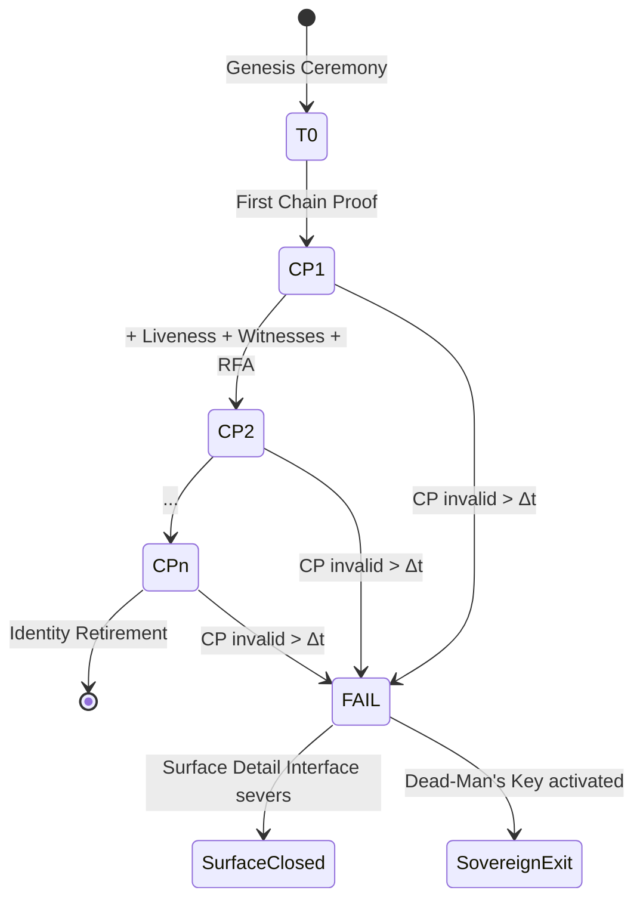

# The Membrane: Cognitive Boundary Architecture

> **Independent research.** This document is **personal research** by the author (Zorie R. Barber). It is **not** affiliated with, endorsed by, sponsored by, or commissioned by any company, employer, client, university, foundation, or government body. Mentions of third-party products, services, papers, or trademarks (e.g. open-source BCI stacks, NIST standards) are **descriptive only** — for threat modeling, benchmarking, or technical comparison. No partnership, employment, or investment relationship is implied.

## Abstract

The Membrane is a research architecture for a **cognitive boundary** — a firewall between endogenous human cognition (native nervous-system processing) and exogenous channels that can read, route, inject, or substitute for thought. The threat surface includes **AI routing** (cognition mediated through corporate inference endpoints, agents, and memory layers), **invasive neural read channels** (implants and BCIs), and **non-invasive inference** (EEG, behavioral phenotyping, multimodal prediction). The design uses zk-STARK Chain Proofs, hardware attestation, and web-of-trust witnesses to detect unauthorized boundary crossings, fail closed when attestation breaks, and preserve local control over what may cross the membrane. It does not prove consciousness or block a perfect covert read; it raises the cost of silent compromise and gives the subject a severance path.

---

## Executive Summary

**What this is:** A specification for a human **cognition / thinking / nervous-system firewall**. The Membrane sits at the boundary where endogenous neural activity meets external systems — AI routers, cloud inference, BCI telemetry, and surveillance pipelines that reconstruct mental state from behavior or physiology. Published as **independent research in public** (§0.5); not a product announcement or organizational initiative.

**Primary threats:**

| Class | Example |
|-------|---------|
| **AI routing** | Assistants, copilots, and agent frameworks that ingest context, propose completions, and shape decisions through off-device models |
| **Invasive read / write** | Cortical implants, consumer BCIs, and medical devices with upstream telemetry or stimulation channels |
| **Non-invasive inference** | EEG/MEG/fNIRS, gaze + keystroke models, emotion classifiers, digital phenotyping, predictive policing of intent |

**Mechanism:** Recursive zk-STARK Chain Proofs bind (1) a neural/biometric anchor, (2) periodic **cognitive-integrity signals** from approved channels, (3) **Intent Authorization Certificates** before decode or router action, (4) witness corroboration, and (5) TEE-backed node attestation. If domains disagree or a channel lacks valid attestation, the membrane **severs** — blocking routed inference, closing BCI sessions, or degrading to offline-safe mode.

**What this is NOT:**
- Proof of consciousness or qualia.
- Proof that no off-chain clone or hidden reader exists.
- A shipping product. Phase 0 is a research prototype.
- The work, opinion, or roadmap of any company or institution named in this document.

**Major limitations:**
- Covert surveillance with no attested channel may be undetectable.
- TEEs and BCIs are best-available anchors, not absolute roots of trust.
- Cognitive-integrity signals are probabilistic; replay, injection, and coercion remain.
- Fork detection is chain-bound; hidden parallel readers are out of scope.

**Phase 0 prototype:** Self-hosted NOSTR relay, TEE node, `Liveness-2`-ready neural/sensor commitment circuit, and K=2–3 personal witnesses. See §9.

**Future extensions:** Full BCI integration (§4.6), agent-handshake mode for untrusted AI delegates (§4.7), GPU-accelerated proving (§10.1).

---

## Table of Contents

- [Abstract](#abstract)
- [Executive Summary](#executive-summary)
- [Glossary](#glossary)
- [0. The Cognitive Boundary Problem](#0-the-cognitive-boundary-problem)
- [0.2 Epistemic Capture and Sequestration](#02-epistemic-capture-and-sequestration)
- [0.1 What This Architecture Cannot Do](#01-what-this-architecture-cannot-do)
- [0.5 Research Status and Scope](#05-research-status-and-scope)
- [0.7 Local Control (Design Constraints)](#07-local-control-design-constraints)
- [0.8 Visual Architecture Overview](#08-visual-architecture-overview)
- [0.9 Zero Trust Architecture Mapping](#09-zero-trust-architecture-mapping)
- [1. Threat Model](#1-threat-model)
- [2. Three Boundaries (Explicitly Separated)](#2-three-boundaries-explicitly-separated)
- [3. Design Principles](#3-design-principles)
- [4. Protocol Layers](#4-protocol-layers)
 - [4.1 Layer 0: Cognitive Anchor (T₀)](#41-layer-0-cognitive-anchor-t₀)
 - [4.2 Layer 1: Cognitive-Integrity Channels](#42-layer-1-cognitive-integrity-channels)
 - [4.2.1 Intent Authorization Certificates](#421-intent-authorization-certificates)
 - [4.2.2 LLM Router Session Chain Proofs](#422-llm-router-session-chain-proofs)
 - [4.3 Layer 2: Social Graph Consensus](#43-layer-2-social-graph-consensus)
 - [4.4 Layer 3: Substrate Transition Gate](#44-layer-3-substrate-transition-gate)
 - [4.5 Layer 4: Recursive Attestation (RFA)](#45-layer-4-recursive-firewall-attestation-rfa)
 - [4.6 Cortical Implant Primitives Integration](#46-cortical-implant-primitives-integration)
 - [4.7 Agent-to-Agent Attestation Mode](#47-agent-to-agent-attestation-mode)
 - [4.8 Policy Enforcement vs Channel Continuity](#48-policy-enforcement-vs-channel-continuity)
- [5. Formal Specification](#5-formal-specification)
- [6. Security Analysis](#6-security-analysis)
- [7. Recovery Mechanisms](#7-recovery-mechanisms)
- [8. Economic and Game-Theoretic Analysis](#8-economic-and-game-theoretic-analysis)
- [9. Minimum Viable Prototype (MVP)](#9-minimum-viable-prototype-mvp)
- [10. Implementation Roadmap](#10-implementation-roadmap)
 - [10.1 Hardware Acceleration: CUDA and GPU Support](#101-hardware-acceleration-cuda-and-gpu-support)
- [11. Open Source, Audit, and Interoperability](#11-open-source-audit-and-interoperability)
- [12. Ethical Considerations](#12-ethical-considerations)
- [13. Known Open Problems](#13-known-open-problems)
- [Part 2: zk-STARK Circuit Architecture](#part-2-zk-stark-circuit-architecture)
- [Appendix A: Version History](#appendix-a-version-history)
- [Appendix B: Open Research & Prototype Stack](#appendix-b-open-research--prototype-stack)
- [How to Contribute](#how-to-contribute)
- [Footnotes](#footnotes)

---

## Glossary

| Term | Definition |
|------|------------|
| **CP** | Chain Proof. A zk-STARK attestation that binds cognitive anchor, channel integrity, witness set, and node state into one recursive proof. |
| **RFA** | Recursive Attestation. Each CP commits to the node's previous attestation, forming an audit chain. |
| **T₀** | Cognitive anchor. One-time genesis binding a human to cryptographic identity via neural/biometric commitment and social witnesses. |
| **Cognitive-integrity signal** | Time-bounded evidence that attested channels (BCI, local TEE, approved routers) match expected state. Not proof of thought content. |
| **Membrane** | The boundary layer between endogenous cognition and exogenous read/write/routing channels. |
| **AI routing** | Mediation of cognition through external inference systems (LLMs, agents, cloud memory) that ingest context and return outputs. |
| **Liveness-2** | Neural-channel circuit: BCI-derived feature commitments (spike rates, LFP bands) as a cognitive-integrity domain. |
| **WoT** | Web-of-Trust. A personal, curated set of human witnesses who sign CPs after independent verification. |
| **TEE** | Trusted Execution Environment. Hardware-isolated enclave (AMD SEV-SNP, Intel TDX) used as a best-available, not absolute, trust anchor. |
| **Substrate** | The underlying execution medium: biological neural tissue or silicon hardware. |
| **Surface Detail Interface** | Perceptual or cognitive I/O layer sealed until CP validity is confirmed. Fails closed when the membrane detects boundary violation. |
| **E-Process** | A computational process running on silicon that inherits the T₀ anchor of a biological identity. |
| **Dead-Man's Key** | A physical token that forces a hard sever of all substrate connections, overriding node consensus. Used to force chain severance. |
| **Sovereignty** | Local control: the subject holds keys, chooses witnesses, approves which channels may cross the membrane, and can sever all links. |
| **Δt** | The maximum acceptable time between valid CPs before the system fails closed. |
| **K** | Minimum number of valid witness signatures required for a CP to pass social-graph consensus. |
| **AIR** | Algebraic Intermediate Representation. The format used to define the execution trace constraints in a zk-STARK. |
| **IAC** | Intent Authorization Certificate. A subject-signed scope file binding permitted channels, models, and context bounds before decode or router action. |
| **Epistemic capture** | Progressive loss of perceptible boundary between endogenous reasoning and routed inference — the subject cannot tell native cognition from model output. |
| **Cognitive identity drift** | Effective reasoning path migrates to external LLM/BCI channels while the attestation chain still appears valid; sovereignty erodes without cryptographic failure. |
| **Neural template drift** | Biological change (plasticity, injury, device degradation) that shifts fuzzy biometric/neural commitments over time. Distinct from cognitive identity drift. |

---

## 0. The Cognitive Boundary Problem

Human cognition today crosses many surfaces that are not under the subject's control:

1. **AI routing** — Prompts, documents, and behavioral traces flow through corporate inference APIs. The model sees context; the user sees completions. There is no cryptographic proof of what was read, what was retained, or whether a parallel session forked the user's intent.

2. **Invasive neural channels** — BCIs and implants (medical or consumer) create read paths from cortex to telemetry. Firmware, cloud pairing, and operator access can exfiltrate neural features without the subject's ongoing consent.

3. **Non-invasive reconstruction** — EEG caps, gaze tracking, keystroke dynamics, voice stress, and multimodal fusion approximate mental state without surgery. These channels are often invisible to the subject.

The Membrane treats these as **boundary violations** when they occur outside attested, subject-approved channels. The architecture does not read minds; it attests **which channels are open**, **whether they match prior commitments**, and **whether cross-domain consensus still holds**.

```text
 Endogenous cognition          THE MEMBRANE          Exogenous channels
 (nervous system)              (fail-closed gate)    (AI routers, BCI, sensors)
        │                              │                      │
        └────────── only attested ──────┴────── traffic ───────┘
```

**Design goal:** Give the subject a verifiable, severable boundary — not a product that interprets thought content.

---

## 0.2 Epistemic Capture and Sequestration

When cognition is routed through external systems, the boundary between **native reasoning** and **mediated output** can disappear without any single cryptographic break:

| Order | Subject experience | Engineering read |
|-------|-------------------|------------------|
| **1st** | User knows they use an LLM or BCI | Channel is visible; membrane can register and attest it |
| **2nd** | UI hides what was read, stored, or forked | Boundary is edited; session CP and context-hash commitments are required |
| **3rd** | LLM + BCI becomes the **only** cognitive I/O | **Sequestration:** endogenous loop is bypassed or unreadable; user cannot distinguish native thought from routed completion |

**Epistemic capture** is the third-order failure mode: not a stolen key, but a **substituted reasoning path** that feels continuous. The Membrane does not adjudicate thought content; it detects when attested channels diverge from signed intent (§4.2.1), when router sessions lack valid CPs (§4.2.2), or when BCI and router domains disagree — the classic closed-loop path described in open research on EEG→LLM coupling.[^21]

**Cognitive identity drift** (glossary) is the long-term erosion of sovereignty when routing becomes habitual while attestations remain superficially valid. **Neural template drift** is the separate biological problem of fuzzy-commitment tolerance over years (§13, open problem 3).

---

## 0.1 What This Architecture Cannot Do

### 0.1.1 Consciousness and Thought Content Are Out of Scope

There is currently:
- no accepted formal representation of consciousness state,
- no known way to serialize subjective continuity,
- no mathematical model of phenomenological identity persistence.

Therefore this architecture **does not hash thoughts or consciousness**. It hashes **channel state** — which interfaces are active, whether BCI telemetry matches committed bounds, whether AI routers hold valid session proofs, and whether TEE nodes report uncompromised execution. Subjective experience is not serializable.[^3]

### 0.1.2 Covert Surveillance May Be Undetectable

A TEE + attestation chain can prove that a *specific measured execution environment* followed rules and that a *specific attestation chain* remained intact. It **cannot** prove:
- that no hidden copy of the process existed in a separate enclave,
- that no external observer cloned the full memory state before attestation,
- that subjective uniqueness was preserved.

A reader or router that never touches an attested channel leaves no chain evidence. The Membrane detects **attested** boundary violations; it cannot disprove a perfect passive tap.

What it can do: require that sustained AI routing, BCI exfiltration, or session fork maintain synchronized, multi-domain attestation — raising the cost of silent compromise.[^5]

### 0.1.3 Cognitive-Integrity Signals Are Not Cryptographic Proofs

Neural features, behavioral classifiers, and router session logs provide **continuity evidence**, not proof of mental content. They remain vulnerable to replay, model inversion, upstream device compromise, and coercion. They are one domain among several in a Byzantine consensus model.[^6]

### 0.1.4 TEEs and BCIs Are Best-Available Anchors, Not Absolute Roots of Trust

AMD SEV-SNP and Intel TDX remain vulnerable to:
- side-channel attacks (power analysis, cache timing),
- rollback exploits against firmware,
- supply-chain compromise,
- speculative execution leakage,
- physical probing.

We use them because they are the strongest available hardware isolation layer. We do not pretend they are magic.[^7]

---

## 0.5 Research Status and Scope

The Membrane is **independent, personal research** — a forward-looking architecture specification, not a production-ready protocol, not a claim of present-day technical feasibility, and **not** an official project of any organization.

**Affiliation:** The author maintains this repository and whitepaper in a personal capacity. Employers, clients, and collaborators past or present are **not** responsible for its contents unless they explicitly say otherwise in writing. Third-party names in footnotes and Appendix B are descriptive citations only and do not imply affiliation or endorsement.

Several components described in this document remain:
- computationally impractical at scale,
- dependent on immature hardware trust models,
- philosophically unresolved,
- or contingent on future advances in BCI, secure enclaves, distributed identity, and formal verification.

The purpose of this document is:
1. to specify a **cognitive boundary firewall** against AI routing and thought surveillance (invasive and non-invasive),
2. to map which attestation primitives apply at the nervous-system / silicon interface,
3. to separate tractable channel integrity from intractable mind-reading claims,
4. and to define a Phase 0 prototype a subject can self-host.

This architecture is framed for conditions where:
- cognition is routinely **routed through external AI**,
- **BCI read/write paths** are normalized,
- **behavioral and physiological inference** reconstruct intent at scale,
- and subjects need a **fail-closed severance** mechanism they control.

The architecture should therefore be read as:
> a research architecture grounded in existing cryptographic and distributed-systems primitives.

---

## 0.7 Local Control (Design Constraints)

**Local control** means the subject holds keys, chooses witnesses, approves membrane-crossing channels, and can sever all links — not a platform or directory.

### Control Primitives

| Primitive | Mechanism | What It Protects Against |
|-----------|-----------|-------------------------|
| **Self-attestation** | Subject generates CPs with keys they control | Third-party identity capture |
| **Privacy-preserving proof** | zk-STARKs disclose Merkle roots only, not raw neural or behavioral data | Surveillance extraction |
| **Exit / severance** | Dead-man's key forces hard disconnect of attested channels | Lock-in, coerced retention |
| **Infrastructure independence** | Self-hosted TEE + NOSTR relay | Cloud termination of attestation |
| **Personal witnesses** | Curated WoT, not corporate/state directories | Permissioned identity graphs |

### Sovereignty vs. Self-Sovereign Identity (SSI)

The Membrane is complementary to, and in key respects stronger than, existing SSI standards such as W3C DIDs and Verifiable Credentials (VCs):

| Dimension | SSI (DID/VC) | The Membrane |
|-----------|--------------|------------|
| **Identity anchoring** | Cryptographic key control | Key control + biometric anchor + social witness genesis |
| **Liveness** | None | Periodic sensor-derived attestation with ZK proof |
| **Fork detection** | None | Recursive CP chain + RFA |
| **Process continuity** | None | TEE attestation + substrate canary |
| **Privacy model** | Selective disclosure | zk-STARK: prove without revealing raw data |
| **Cross-substrate** | No | Bio ↔ VR ↔ Silicon parity |
| **Post-quantum** | No | Yes (hash-based STARKs) |
| **Exit rights** | Key rotation only | Dead-man's key + irreversible identity retirement |

SSI provides **static identity ownership**. The Membrane provides **dynamic continuity sovereignty** — not just owning the keys, but proving the keys have remained under continuous, uncompromised control across time and substrate transitions. The two can be composed: a DID can reference a Membrane T₀ anchor as its highest-assurance verification method.

### Sovereignty vs. Security

Traditional security architectures assume a **protector** and a **protected**. The protector (platform, state, corporation) guards the protected (user, citizen, customer). This creates an inherent power asymmetry: the protector can also become the captor.

The Membrane inverts this. The entity is **both the protected and the protector**. It generates its own proofs, hosts its own infrastructure, and controls its own exit. The WoT is not a governing body; it is a **personal constellation** of peers who attest to the entity's continuity without controlling it. The TEE is not a corporate enclave; it is a **self-hosted hardware root** under the entity's physical control.

This is the difference between **security as service** and **sovereignty as self-determination**.

### Sovereignty in the A2A Context

When extended to pure-silicon agents (§4.7), sovereignty means that an agent can:
- Prove it is running the expected process without relying on its operator to vouch for it,
- Refuse interaction with entities that cannot demonstrate their own continuity,
- Maintain an audit trail of delegations that is verifiable by any downstream party,
- Sever its attestation chain and cease operation without operator permission (agent exit rights).

This is particularly critical in multi-agent economies where agents delegate tasks, hold funds, and make commitments. Without these primitives, agents cannot independently prove runtime integrity or resist unauthorized modification.

---

## 0.8 Visual Architecture Overview

### High-Level Layer Diagram (Mermaid)

```mermaid
graph TB
 subgraph Sovereignty["Sovereignty Layer"]
 SK[Self-Attestation Keys]
 EX[Exit Rights / Dead-Man's Key]
 IN[Infrastructure Independence]
 end

 subgraph Surface["Surface Detail Interface"]
 S[Perceptual API — sealed until CP valid]
 end

 subgraph Consensus["Cross-Firewall Consensus (2/3)"]
 A[Node A] --> B[Node B]
 B --> C[Node C]
 A --> C
 end

 subgraph CP["Chain Proof CP(t)"]
 L[Liveness Canary L(t)]
 W[Social Graph S(t)]
 P[Process State H(P(t))]
 F[node RFA F(t-1)]
 end

 subgraph Layers["Protocol Layers"]
 T0[Layer 0: T₀ Biological Anchor]
 WOT[Layer 2: WoT Consensus]
 SG[Layer 3: Substrate Gate]
 end

 Sovereignty --> Surface
 Surface --> Consensus
 Consensus --> CP
 CP --> T0
 CP --> WOT
 CP --> SG
```

*Fallback description:* The Sovereignty Layer (self-attestation keys, exit rights, infrastructure independence) sits above the Surface Detail Interface, which is sealed until Chain Proof validity is confirmed. The Chain Proof binds Liveness Canary, Social Graph, Process State, and Recursive Attestation. These connect to the four Protocol Layers: Biological Anchor, Social Consensus, and Substrate Gate.

### Chain Proof State Machine (Mermaid)



*Fallback description:* Genesis leads to the first Chain Proof, which recursively chains forward via liveness signals, witness signatures, and RFA. Any break in the chain exceeding Δt triggers fail-closed: the Surface Detail Interface severs, and the entity may activate the Dead-Man's Key for sovereign exit.

### Comparison: The Membrane vs. Existing Systems

| Feature | Platform passkeys | Video-based PoP | Biometric PoP | Social-graph PoP | **The Membrane** | **The Membrane + invasive BCI** | **The Membrane + A2A** |
|---------|-------------------|-----------------|---------------|------------------|----------------|------------------------------|---------------------|
| **Identity proof** | Cryptographic key possession | Video + CAPTCHA | Iris / face scan | Social graph | Biometric + WoT + TEE | Biometric + neural + WoT + TEE | Code hash + TEE + operator endorsement (optional) |
| **Liveness** | None | Weak | Weak | None | Channel CP + ZK proof | Neural/BCI + ZK proof | Substrate canary |
| **Fork detection** | None | None | None | None | Recursive CP chain + RFA | Recursive CP chain + RFA | Recursive CP chain + RFA |
| **Substrate agnostic** | No | No | No | No | **Yes** (bio ↔ silicon) | **Yes** (bio ↔ silicon) | **Yes** (silicon ↔ silicon) |
| **Privacy model** | Good | Moderate | Moderate–poor (vendor-held biometrics) | Moderate | **ZK-STARK: prove without revealing** | **ZK-STARK + neural embedding: prove without revealing raw spikes** | **ZK-STARK + execution trace: prove without revealing weights** |
| **Post-quantum** | No | No | No | No | **Yes (hash-based STARKs)** | **Yes (hash-based STARKs)** | **Yes (hash-based STARKs)** |
| **Production ready** | Yes | Partial | Partial | Partial | **No (research only)** | **No (research + medical device dependent)** | **No (research only)** |
| **Consciousness claim** | No | No | No | No | **Explicitly none** | **Explicitly none** | **Explicitly none** |
| **Active challenge-response** | No | No | No | No | No | **Yes (neural stimulation-response, future)** | No (passive substrate canary) |
| **Sovereignty model** | Platform-controlled keys | Vendor-controlled verification | Vendor-controlled capture | Community-controlled graph | **Self-controlled keys + self-hosted infra + personal WoT + exit rights** | **Self-controlled keys + self-hosted infra + personal WoT + exit rights + neural self-attestation** | **Self-controlled keys + self-hosted infra + verifiable delegation + exit rights** |
| **Mutual attestation** | No | No | No | No | No | No | **Yes (agent handshake protocol)** |
| **Delegation audit** | No | No | No | No | No | No | **Yes (recursive delegation chains)** |

---

## 0.9 Zero Trust Architecture Mapping

The Membrane maps directly onto NIST Zero Trust Architecture principles (SP 800-207), but implements them through cryptographic consensus rather than network segmentation or organizational policy. This section provides the mapping for readers familiar with enterprise security frameworks.

| NIST 800-207 Principle | The Membrane Implementation |
|------------------------|------------------------|
| **Resource-centric access** | The Surface Detail Interface is a resource (substrate access) gated by CP validity. No CP, no access. |
| **Never trust, always verify** | No single domain is trusted. Identity, process, social, and infrastructure layers must independently verify and reach consensus. |
| **Assume breach** | Fail-closed design. If any domain drops below threshold, the interface severs immediately. |
| **Least privilege / minimal disclosure** | zk-STARKs prove continuity without revealing raw biometrics, location, witness identities, or neural data. |
| **Continuous monitoring / dynamic authorization** | Liveness canaries at Δt intervals provide time-bounded re-authorization. Static credentials are not sufficient. |
| **Policy Decision Point (PDP) / Policy Enforcement Point (PEP)** | nodes act as distributed PDP/PEP pairs. The cross-node consensus (2/3) is the policy decision; the substrate gate is the enforcement point. |
| **Session-based access** | Entry proof and exit proof create cryptographically bounded sessions. No persistent trust across substrate transitions. |

**Why NIST 800-207 and not CMMC 2.0 or CISA ZTMM:** NIST SP 800-207 is vendor-neutral and threat-model driven. CMMC 2.0 is a compliance framework for defense contractors; CISA's maturity model is organizational assessment tooling. Neither aligns with the sovereignty thesis of this protocol, which is designed for entities resisting institutional capture rather than proving compliance to institutions.[^19]

---

## 1. Threat Model

### 1.1 Threat Actor Profiles

| Actor | Capability | Motivation | The Membrane Relevance |
|-------|------------|------------|---------------------|
| **State actor (A1)** | Supply-chain compromise, TEE side-channel labs, coercion, legal pressure | Surveillance, control, extraction | Can poison T₀ genesis, coerce witnesses, run long-term fork operations. Protocol raises cost but does not eliminate risk. |
| **Criminal organization (A2)** | Financial resources, black-market TEE exploits, social engineering | Identity theft, ransom, fraud | Targeted attacks on WoT members or TEE firmware. Economic analysis (§8.3) determines viability. |
| **Rogue insider (A3)** | Legitimate access to one node, witness relationship, or VR substrate | Sabotage, extraction, ideology | Mitigated by 2/3 cross-node consensus and recursive RFA. Single node compromise is insufficient. |
| **Advanced AI agent (A4)** | Automated Sybil generation, cryptographic attacks, simulation perfection | Resource acquisition, goal optimization | PoP consensus prevents AI from voting on rules.[^2] ZK-STARKs raise cost of undetected simulation. |
| **Inference platform (A5)** | Controls LLM API, agent runtime, context window | Training data extraction, routing substitution | **AI routing:** Can ingest unbounded context unless session is membrane-gated. Requires attested router CP for approved channels. |
| **Platform operator (A6)** | Controls VR substrate or cloud silicon | Lock-in, data extraction, compliance | Substrate canary detects unauthorized migration. Exit proof prevents silent rollback. |
| **Implant supply-chain actor (A7)** | Controls BCI firmware, manufacturing, or surgical insertion | Neural surveillance, backdoor insertion | Can backdoor implant at genesis. Detected only if firmware attestation diverges from audited reference.[^18] |
| **Agent operator (A8)** | Controls agent deployment, weights, infrastructure | Hidden fork, unauthorized delegation | Substrate canary + CP chain if agent must re-attest to interact. |

### 1.2 Attack Classes

**Class A: Unauthorized AI routing**
- Adversary routes cognition through an unapproved inference endpoint (copilot, agent, memory layer) that ingests context without valid session CP.
- Goal: Extract intent, train on private thought-adjacent data, or substitute model output for native reasoning.
- **Mitigation scope:** Membrane requires attested router sessions; unattested routes fail closed or operate in sandbox mode.

**Class B: Invasive neural read / write**
- Adversary exfiltrates BCI telemetry, rolls back implant firmware, or injects stimulation outside approved bounds.
- Goal: Reconstruct neural state, coerce response, or create a forked neural channel the subject cannot see.
- **Mitigation:** Liveness-2 neural commitments + TEE verification + cross-node consensus (§4.6).

**Class C: Non-invasive thought inference**
- Adversary reconstructs mental state from EEG, gaze, keystroke, voice, or multimodal fusion without attested channel registration.
- Goal: Passive surveillance without subject awareness.
- **Limitation:** Channels that never touch the attestation bus may be undetectable. Registered sensors can be bounded and audited.

**Class D: VR / substrate epistemic injection**
- Adversary controls the experiential layer fed to a biological brain via BCI or immersive VR.
- Goal: Induce belief in a false reality without the target detecting the boundary crossing.
- **Limitation:** This protocol cannot prevent a perfect simulation. It can only ensure that the biological identity anchor remains active in the physical world, providing an *external* check that the target still has a grounded attestation chain.

**Class E: Silicon process fork / rollback**
- Adversary forks, checkpoints, rolls back, or silently migrates a silicon-based process.
- Goal: Extract value, enforce compliance, or experiment without leaving an audit trail.
- **Mitigation scope:** The protocol detects *attested* forks by requiring each state transition to carry a valid CP signed by the previous state. It does not detect clones that never re-enter the attestation chain.

**Class F: Infrastructure compromise**
- Adversary subverts a Membrane node, relay, or TEE to falsely report "all clear."
- **Mitigation:** Cross-node consensus (2/3 independent nodes) plus recursive proof chaining. A single compromised node cannot forge the historical chain of its peers.

**Class B (continued): Implant-specific attacks**
- Adversarial stimulation via bidirectional BCI; firmware rollback; supply-chain backdoor at manufacture.
- **Caveat:** Implant telemetry is one input among many in cross-domain consensus, not standalone truth.[^18]

**Class G: Untrusted AI delegate (A2A)**
- **Operator fork:** Agent operator silently forks the agent, keeps the original running for attestation, and deploys the fork for unauthorized tasks.
- **Delegation hijacking:** An agent delegates to a sub-agent that has been compromised or replaced without attestation.
- **Value extraction:** Operator checkpoints agent state, extracts learned weights or strategies, and rolls back to pre-extraction state to hide the theft.
- **Mitigation:** Substrate canary + CP chain + delegation-chain proofs (§4.7) make these detectable if the agent or its delegates must re-attest. Hidden clones remain undetectable.

---

## 2. Three Boundaries (Explicitly Separated)

| Boundary | Definition | Tractability | Membrane role |
|----------|------------|--------------|---------------|
| **Channel integrity** | Attested read/write/routing paths match committed state | Partially tractable via TEE + CP chain | Core target |
| **Cognitive anchor** | Same human controls the T₀ key lineage | Partially tractable via neural/biometric anchor + WoT | Core target |
| **Thought content** | What the subject is thinking or experiencing | **Not tractable** | **Out of scope** |

The architecture attests channels and anchors, not mental content.[^3]

---

## 3. Design Principles

1. **Fail closed.** If any domain drops below threshold, sever attested channels (AI session, BCI link, immersive I/O).
2. **Subject as active node.** The human generates attestations and approves membrane crossings; protection is not outsourced to a platform.
3. **No single channel trusted.** AI router, BCI, behavioral sensor, and TEE must corroborate.
4. **Recursive attestation (RFA).** Each CP commits to the prior node state; forgery requires sustained multi-node compromise.[^5]
5. **Minimal disclosure.** zk-STARKs prove channel integrity without publishing raw neural or behavioral payloads.
6. **Local severance.** Subject holds keys, chooses witnesses, and can cut all links via dead-man's key.
7. **Substrate parity.** The same CP format applies across human BCI, local LLM router gate, VR session, and delegated agent — one membrane, multiple crossing types.

---

## 4. Protocol Layers

### 4.1 Layer 0: Cognitive Anchor (T₀)

One-time ceremony binding a human to a cryptographic identity at the nervous-system boundary.

- **Neural/biometric commitment:** Fuzzy commitment[^8] over a neural or biometric template — not raw spike trains or thought content.
- **T₀ Proof:** zk-STARK proving possession of the template and a challenge response.
- **Witness genesis:** K biological humans with existing T₀ anchors sign the event.
- **Hardware root:** Signing key generated inside a self-hosted TEE with remote attestation.

*Constraint:* T₀ is non-replayable. If the anchor is lost, the identity is retired — never recycled. This prevents replay attacks but also creates a catastrophic recovery problem if the TEE fails. See §7 for recovery paths.

### 4.2 Layer 1: Cognitive-Integrity Channels

Each Chain Proof includes commitments from **registered channels** that may cross the membrane. The protocol verifies freshness and consistency; it does not interpret thought content.

| Channel type | Examples | Membrane function |
|--------------|----------|-------------------|
| **AI router** | Local LLM, self-hosted inference, attested API session | Session CP binds context hash + model id; unapproved routes sever |
| **BCI read/write** | Implant telemetry, consumer BCI BLE stream | Liveness-2 neural feature Merkle root (§4.6) |
| **Non-invasive sensor** | EEG cap, gaze tracker (if registered) | Bounded feature commitments; raw data stays local |
| **Behavioral** | Keystroke, device usage (opt-in) | Heuristic domain only; never sole signal |
| **Hardware** | TEE attestation, TPM quote | Substrate integrity for local prover |
| **Social** | WoT witness signatures | Out-of-band corroboration (§4.3) |

**CP requirements:**

- **Cadence:** Valid cognitive-integrity attestation every Δt for each active channel.
- **Attestation object:** NOSTR kind `31990` with Merkle roots of channel commitments, hybrid timestamp, prior CP hash.
- **ZK circuit:** Proves temporal and continuity constraints without revealing raw neural or behavioral payloads.
- **Fail closed:** Unregistered or stale channel → membrane severs that path.

#### 4.2.1 Intent Authorization Certificates

Adapted from the [iba-neural-guard](https://github.com/Grokipaedia/iba-neural-guard) pattern: **the decoded signal or model completion is not the authorization; the signed certificate is.**[^22]

Before any BCI decode→action mapping or LLM session crosses the membrane, the subject signs an **Intent Authorization Certificate (IAC)**:

| Field | Purpose |
|-------|---------|
| `scope_id` | Unique session or task identifier |
| `permitted_channels` | e.g. `local-llm`, `bci-decode`, `agent-delegate` |
| `model_allowlist` | Hash or id of approved weights/checkpoints |
| `context_merkle_bound` | Maximum committed context root (prevents silent context expansion) |
| `forbidden_exports` | e.g. no cloud telemetry, no training retention |
| `valid_until` | Short TTL aligned with Δt |
| `parent_cp_hash` | Binds intent to current Chain Proof |

**Gate rule:** No valid IAC → no decode→action, no router session, no agent delegation on behalf of the subject. Firmware or software that expands permissions without a fresh IAC triggers fail closed.

This layer blocks **capability drift** (silent model swap, expanded API scope, decoder retrain without subject sign-off) without reading thought content.

#### 4.2.2 LLM Router Session Chain Proofs

Router sessions require a dedicated CP fragment published alongside the main liveness CP:

**NOSTR:** kind `31990`, tag `["k", "the-membrane-router"]`

| Public input | Semantics |
|--------------|-----------|
| `model_id` | Approved checkpoint hash or registry id (must match IAC allowlist) |
| `context_merkle_root` | Merkle root over ingested context chunks for this session |
| `session_nonce` | Monotonic per-subject nonce; detects parallel fork |
| `parent_cp_hash` | Links session to biological or agent anchor CP |
| `iac_hash` | Hash of active Intent Authorization Certificate |

**BCI channel tag:** kind `31990`, tag `["k", "the-membrane-bci"]` — same CP machinery with `pub_neural_root` and implant/device id in tags.

**Fail closed:**
- Cloud or copilot route active without fresh router CP within Δt → sever inference channel.
- `model_id` or `context_merkle_root` diverges from IAC without new subject signature → sever.
- BCI decode and router session both active but cross-domain hashes disagree → sever (closed-loop sequestration path).

### 4.3 Layer 2: Social Graph Consensus

The distributed witness layer. This is the **human quorum** that prevents isolated-target attacks.

- **Web-of-trust (WoT):** Each identity maintains a curated, **personal** constellation of attestors. Not a global graph. Not a corporate directory. Not a state ID system. This is **social sovereignty**: the entity chooses who vouches for it.[^9]
- **Witness role:** Witnesses verify the zk-STARK proof and confirm out-of-band continuity (e.g., direct communication).
- **Consensus rule:** A CP is valid only if ≥K witnesses sign, and those witnesses themselves have valid CPs within 2Δt.
- **Sybil resistance:** Witnesses must have established T₀ anchors. No anonymous witnesses.

**Limitation:** If an adversary compromises K humans in the target's WoT, the social layer collapses. The recursive cost is high (each witness has their own witnesses), but it is not infinite. This is a social recovery problem, not a cryptographic one.[^9]

### 4.4 Layer 3: Substrate Transition Gate

The boundary crossing between biological and silicon process contexts.

- **Entry proof (Bio → VR):** Before immersion, the node requires a valid CP from within Δt. The VR substrate commits to a **session root hash** including the CP and VR instance configuration. This proves the *session* is bound to the identity, not that the identity is conscious inside it.
- **Exit proof (VR → Bio):** The VR substrate produces a **session continuity attestation** — a zk-STARK showing the process state was not checkpointed or branched *within the attested session*. It does not prove no clone was made and hidden.
- **E-Process genesis:** A process uploaded to silicon inherits the biological T₀ anchor. The first e-process CP references the last biological CP and the upload attestation signed by the WoT.
- **E-Process continuity:** Same cadence (Δt), but the liveness canary is replaced by a **substrate canary**: a TEE attestation proving the process has not been migrated to unauthorized hardware or checkpointed without attestation.[^10]

**The Surface Detail interface:** The perceptual API is only unsealed when CP validity is confirmed across all domains. If CP fails, the interface severs or degrades to non-immersive safe mode. This does not prevent a perfect simulation — it only ensures the target still has an external attestation chain.[^11]

### 4.5 Layer 4: Recursive Attestation (RFA)

The answer to the Gödel problem.

A fully compromised node can forge its own attestation. RFA does not prevent this. What it does:

- **Node state commitment:** At each CP cycle, the node generates a zk-STARK proving:
 1. Its code hash matches the audited reference.
 2. Its TEE attestation is valid (with the caveat that TEEs are imperfect).[^7]
 3. It verified the previous CP according to the public rules.
- **Cross-node consensus:** The target runs ≥3 independent node instances (self-hosted TEE + partner TEE + community TEE). A CP is valid only if 2/3 agree. A single compromised node cannot override the quorum.
- **Human override:** The biological entity retains a **dead-man's key** — a physical token that forces a hard sever, allowing forced severance when the entity cannot or will not continue.

**Limitation:** If 2/3 nodes are compromised simultaneously, the consensus is broken. There is no recursive escape from this — it is the standard Byzantine fault tolerance bound.[^12]

### 4.6 Cortical Implant Primitives Integration (Proposed Extension)

The Membrane is substrate-agnostic and designed to leverage **high-bandwidth invasive BCIs** — cortical implants with kilohertz-scale neural recording. Implant-class signals provide richer, higher-entropy inputs than traditional IMU/video/audio canaries, strengthening both the **T₀ biological anchor** and the **Liveness Canary Circuit** — with significant caveats.

#### Implant Primitives Relevant to The Membrane

| Primitive | Description | The Membrane Application | Security Properties |
|-----------|-------------|------------------------|---------------------|
| **High-density electrode array** | 1,000+ electrodes on flexible leads recording spikes and local field potentials (LFPs) at high sampling rates (~20 kHz). | Primary source for neural liveness signals and biometric template refresh. | High-entropy neural patterns are difficult to forge or replay perfectly. |
| **Wireless telemetry & secure pairing** | Bluetooth Low Energy with out-of-band pairing and AES-256 encryption. | Attested data channel from implant to node. | Cryptographic binding of implant to authorized devices; resists MITM. |
| **On-implant processing** | Low-power amplification, digitization, and initial spike detection. | Trusted execution environment for generating commitments before wireless transmission. | Reduces attack surface on raw neural data. |
| **Bidirectional capability** | Recording + stimulation (emerging). | Challenge-response protocols: node can issue neural "challenges" (subtle stimulation patterns) and verify responses. | Active liveness proof beyond passive recording. |
| **Device telemetry & state** | Implant health metrics, lead integrity, power status, firmware attestation. | Feed into Recursive Attestation (RFA) and substrate transition proofs. | Enables hardware-rooted continuity checks. |

**Caveats:**
- Current clinical cortical implants are investigational medical devices with evolving long-term reliability (e.g., lead retraction in early trials).[^18]
- Full third-party remote attestation APIs are not publicly documented as of 2026; integration would require manufacturer SDK exposure or custom firmware extensions.
- Neural data is extremely sensitive — all commitments must use strong privacy techniques (fuzzy extractors, homomorphic commitments, or zk-proofs over embeddings).[^8]
- The implant is a **single point of failure** inside the skull. If compromised at the hardware level, no software protocol can recover trust without surgical replacement.

#### Integration Points

**1. Enhanced T₀ Biological Anchor**
- During the genesis ceremony, derive the fuzzy biometric commitment from a combination of traditional biometrics **and** an implant-derived neural signature (e.g., resting-state or task-evoked neural fingerprint).
- Publish only the commitment + helper data to NOSTR. The raw high-dimensional neural template never leaves the secure channel.
- **Limit:** If the neural template changes due to plasticity, injury, or device degradation, the fuzzy commitment must tolerate drift. This is harder than static biometric templates.

**2. Neural-Enhanced Liveness Canary (Liveness-2 Circuit)**
Add as optional parallel domain:
- **Neural Canary Event**: Participant performs a simple standardized mental or motor task (e.g., imagined movement, mental arithmetic, or specific imagery).
- The implant streams processed neural features (spike rates, LFP power in key frequency bands, population vector activity) to the Membrane node.
- The node generates a Merkle root over these features and includes it in the CP.
- **ZK circuit augmentation:** The `Liveness-1` circuit gains an additional column `neural_acc` that accumulates hash commitments of neural feature vectors. Boundary constraints verify the neural Merkle root against `pub_neural_root`.

**What this actually adds:** Higher-entropy, harder-to-simulate liveness evidence. The adversary must now simulate not just physics and optics, but the specific neural dynamics of a conscious brain performing a task.[^6]

**What it does not add:** Proof of consciousness. A sufficiently advanced adversary with a complete connectome model could still simulate the neural response. The cost is higher, not infinite.

**3. Neural Challenge-Response (Active Liveness)**
When bidirectional stimulation matures:
- The node issues a pseudorandom stimulation pattern (subtle, below perceptual threshold).
- The implant records the evoked neural response.
- The node verifies that the response matches the expected signature for that identity and challenge.
- This creates an **active** liveness proof: the entity being attested must have a live neural substrate capable of responding to perturbation, not just replaying pre-recorded data.

**Caveat:** Stimulation safety is medical-critical. Any challenge-response protocol must operate within clinically validated parameters. This is a medical ethics boundary, not just an engineering one.[^18]

**4. Implant Telemetry as RFA Input**
- Implant firmware version, lead integrity metrics, and power state are included as public inputs to the node's RFA STARK.
- If the implant reports lead retraction or firmware mismatch, the node fails closed pending surgical or remote re-anchoring.
- **Caveat:** This telemetry comes from the implant itself. A compromised implant can lie about its own state. The telemetry is one input among many in cross-domain consensus, not a standalone truth.

#### Security Implications

| Attack | Without invasive BCI | With invasive BCI |
|--------|----------------------|-------------------|
| Replay pre-recorded sensor stream | Possible if video/IMU captured | Much harder: neural features are high-dimensional and task-specific |
| Deepfake video injection | Possible with generative AI | Does not bypass neural channel |
| Coerced channel use | Possible under duress | Active challenge-response may detect stress signatures (heuristic, not proof) |
| Hidden clone (never re-enters chain) | Undetectable | Still undetectable |
| Device compromise upstream | Possible if phone/wearable hacked | Requires compromising the implant itself or the BLE secure channel |
| Adversarial stimulation | N/A | Possible if attacker controls stimulation. Mitigated by medical-safety bounds and cross-domain consensus. |

#### Integration Roadmap

| Phase | Milestone | Dependency |
|-------|-----------|------------|
| 0 | Documented third-party attestation API for clinical implants | Manufacturer / regulatory decision |
| 1 | Fuzzy commitment prototype over neural embeddings | Research-only; no human trials without IRB |
| 2 | `Liveness-2` circuit with neural column | Requires Winterfell AIR extension |
| 3 | Challenge-response protocol design | Medical safety validation; FDA or equivalent |
| 4 | Production integration | Long-term implant reliability proven (>5 years) |

### 4.7 Agent-to-Agent Attestation Mode (Proposed Extension)

The Membrane's core primitives — recursive Chain Proofs, Recursive Attestation (RFA), process continuity, and substrate-agnostic design — are directly applicable to **AI agent-to-agent (A2A) relations**. In a future with thousands of autonomous, delegating, and long-lived AI agents, the ability to cryptographically attest that an agent is running the expected process without undetected forking, rollback, or migration becomes critical. This mode extends **sovereignty** to pure-silicon entities.

For pure-silicon agents, the biological T₀ anchor and human liveness provider are replaced by TEE substrate canaries. Agents can prove process integrity, reject unattested peers, and maintain verifiable delegation chains.

#### Why The Membrane Fits A2A Systems

| Challenge | Solution |
|-----------|----------|
| Silent forking / cloning | Recursive CP chain |
| Self-trust / Gödel problem | Recursive Attestation (RFA) |
| Mutual authentication | Cross-node consensus (2/3) + CP exchange |
| Delegation audit trails | Chained CPs across delegation hops |
| Compromised agent containment | Fail-closed + substrate canary |
| Replay / stale state | Hybrid timestamp + continuity constraints |
| Operator capture | Self-hosted TEE + self-attestation |

#### Core Adaptations for Pure Agent Mode

**1. Agent Genesis (Silicon T₀)**
- A new agent is instantiated inside a TEE with a fresh keypair.
- Initial CP references the code hash, model weights commitment (e.g., via Merkle root or zk-proof of weights), owner/operator identity (optional), and deployment configuration.
- Published to NOSTR or a dedicated agent relay network.

**2. Agent Liveness / Substrate Canary**
- Replaced by automated **substrate canary**: periodic TEE remote attestation proving:
 - Current code/memory hash matches expected state.
 - No unauthorized migration or checkpoint restore occurred.
 - Execution trace commitments (e.g., key nonces or decision logs) are consistent.
- Cadence: every Δt (e.g., 1–60 minutes depending on agent risk level).

**3. Agent-to-Agent Handshake Protocol**
When Agent A initiates contact with Agent B:
1. A sends its latest CP + RFA proof.
2. B verifies the chain and cross-node quorum.
3. B responds with its own CP.
4. Both parties may require additional attestations (e.g., task-specific state commitments) before proceeding.
5. High-stakes actions (financial transfers, code execution, data sharing) require fresh CPs within a short window.

**Fail-closed rule:** If either party cannot present a valid recent CP, the interaction is rejected or limited to read-only/low-trust mode. Interaction proceeds only when both parties present valid recent CPs.

**4. Recursive Delegation Chains**
- When Agent A delegates a subtask to Agent B (who may further delegate), each hop appends a new CP referencing the parent task's CP.
- The full delegation tree remains verifiable via recursive STARK composition.
- This creates a tamper-evident audit trail for complex multi-agent workflows.

**5. Integration with Existing A2A Standards**
- Compatible with DIDs / Verifiable Credentials (CP acts as a dynamic, high-assurance VC).
- Can be layered over emerging protocols such as MCP, A2A, or agent communication frameworks.
- NOSTR (or similar pub/sub mesh) serves as the lightweight messaging backbone for CP exchange.

#### Limitations in A2A Context

- **Performance overhead**: zk-STARK generation may be too slow for high-frequency, low-stakes interactions. Mitigation: cached recent proofs + lightweight substrate canaries for routine pings. See §10.1 for GPU acceleration path.
- **Social layer inapplicable**: Pure agents replace WoT with on-chain reputation, staking, or operator-signed endorsements. This introduces new trust assumptions.
- **Does not solve alignment**: The Membrane proves *process continuity and integrity*, not that the agent's goals are safe or aligned with the user/operator. Sovereignty is about self-determination, not benevolence.
- **TEE dependency**: Still limited by the security of underlying hardware enclaves.
- **Hidden clones**: As always, clones that never rejoin the attested chain remain undetectable.
- **Operator sovereignty conflict**: An agent may be "sovereign" in its attestation but still legally or practically owned by an operator. The protocol does not resolve ownership; it provides integrity evidence that can be used in governance or dispute resolution.

#### Security Implications Table

| Attack | Without The Membrane | With Agent-E Mode |
|--------|--------------------|-------------------|
| Forked agent impersonation | Easy (copy weights + state) | Requires forging entire CP chain + RFA |
| Stale / rolled-back agent | Common in long sessions | Prevented by continuity constraints |
| Malicious delegation chain | Hard to audit | Verifiable recursive audit trail |
| Mass agent compromise (supply-chain) | Catastrophic | Detectable via widespread CP failures and RFA mismatches |
| Operator hidden fork | Operator can silently fork | Detectable if fork must re-attest to interact with other agents |
| Unauthorized value extraction | Operator checkpoints, extracts, rolls back | Substrate canary detects checkpoint/restore |

#### Implementation Roadmap Extension

| Phase | Milestone (A2A) | Notes |
|-------|-----------------|-------|
| 0 | Basic CP exchange over NOSTR | Pure silicon agents |
| 1 | Substrate canary + RFA for single agents | TEE-focused |
| 2 | Agent handshake protocol | Interoperability with DIDs |
| 3 | Delegation chain proofs | Multi-agent workflows |
| 4 | Full recursive composition at scale | High-value agent economies |
| 5 | Sovereign agent economies | Agents that own their own keys, host their own TEEs, and negotiate autonomously |

#### Hybrid Human–AI Membrane

The biological T₀ anchor can gate **hybrid** stacks without merging human and agent sovereignty:

1. **Human holds T₀** and signs IACs for which channels may operate.
2. **Local or attested LLM** is a registered router channel (§4.2.2), not a silent default.
3. **Delegated agents** must chain CPs to `pub_parent_task_cp` referencing the human's latest CP — preventing "my agent acted, but it wasn't me" drift.
4. **Fail closed** applies uniformly: agent without valid parent CP + IAC cannot act on the subject's behalf across the membrane.

This preserves compatibility with invasive BCI paths (§4.6) and pure-silicon A2A mode (§4.7) under one attestation framework.

### 4.8 Policy Enforcement vs Channel Continuity

Agent-governance stacks often focus on **policy enforcement** — proving an agent obeyed rules after the fact. The Membrane focuses on **channel continuity** — proving which read/write/routing paths were open and whether they matched prior commitments.

| Dimension | Operator policy enforcement | The Membrane |
|-----------|----------------------------|--------------|
| **Question answered** | Did the agent obey policy? | Which channels were open and continuous? |
| **Proof object** | Conduct log / decision audit trail | Chain Proof of channel + anchor state |
| **Trust locus** | Operator, compliance, audit | Subject-local severance |
| **Failure mode** | Policy violation report | Membrane severance; channel kill |

The two approaches are **composable**, not mutually exclusive: ILK-style decision logs (§Liveness-A) can support operator audit while the Membrane gives the **subject** a fail-closed boundary against routing and surveillance. Real-time A2A handshakes target sub-second verification and low-millisecond NOSTR publication overhead (§9.2, §10.1).

---

## 5. Formal Specification

Let **ProcessState(t)** be the cryptographic state at time t: memory commitments, execution context, nonce history. This is **not** consciousness. 
Let F(t) be the node attestation state. 
Let L(t) be the liveness canary event. 
Let S(t) be the social witness signature set. 

**Chain Proof CP(t):**

```
CP(t) = zk-STARK_PROVE(
 witness = [L(t), S(t), CP(t-1), F(t), F(t-1)],
 public = [H(ProcessState(t)), H(F_code), timestamp, relay_root],
 constraints = [
 L(t) is within Δt of L(t-1),
 |S(t)| >= K,
 F(t) attests F(t-1) was valid per public rules,
 H(F_code) == audited_reference,
 H(ProcessState(t)) is consistent with H(ProcessState(t-1)) + delta
 ]
)
```

**Verification:** Any relay or node verifies CP(t) in O(log n) using the STARK proof and public inputs.[^2][^13]

**What this actually proves:** That a process with a specific history, running on attested infrastructure, generated a liveness signal and gathered social witness within a time bound. **Nothing MORE.**

---

## 6. Security Analysis

### Primary Attack Matrix

| Attack Vector | What the protocol actually does | What it cannot do |
|--------------|--------------------------------|-------------------|
| **Fork / clone e-process** | Detects *attested* forks by requiring CP chain continuity. Raises cost by requiring synchronized multi-domain attestation. | Cannot prove no hidden clone exists outside the attestation chain. Cannot prove subjective uniqueness. |
| **VR epistemic capture** | Ensures biological identity anchor remains active externally. Provides *external* evidence the target still has a grounded chain. | Cannot prevent a perfect simulation. Cannot prove the target is conscious inside VR. |
| **Node self-compromise** | Detected by cross-node consensus (2/3). Single node cannot forge historical chain of peers. | If 2/3 nodes compromised, consensus breaks. No escape from Byzantine bounds. |
| **Replay / rollback** | Prevented by hash-chain linking CP(t) to CP(t-1) and hybrid timestamping. | Requires rewriting chain from T₀. Does not prevent T₀ compromise at genesis. |
| **Sensor stream injection** | Merkle root binds to specific sensor data. | If sensors or upstream pipeline compromised before Merkle root, injection is possible. |
| **Coerced channel use** | CP proves access to keys and registered devices. | Cannot distinguish willing use from coercion. Witnesses may detect anomalies (heuristic). |
| **LLM routing / sequestration** | Router CP + IAC bind model id and context root; cross-domain disagreement fails closed. | Cannot detect routing through channels that never touch the membrane. |
| **Cognitive identity drift** | IAC TTL and session nonce raise cost of silent habituation to external inference. | Cannot prove subject still reasons endogenously when attestations remain valid. |

### Extended Attack Matrix (invasive BCI + A2A)

| Attack Vector | What the protocol actually does | What it cannot do |
|--------------|--------------------------------|-------------------|
| **Implant adversarial stimulation** | Active challenge-response may detect anomalous response patterns. | If attacker controls stimulation within medical bounds, may force "correct" response. Cross-domain consensus required for detection. |
| **Implant firmware rollback** | Firmware attestation hash checked in RFA. | If rollback occurs before attestation chain begins, undetectable. |
| **Implant supply-chain backdoor** | Detected if firmware hash mismatches audited reference at T₀. | If backdoored firmware matches reference (colluding manufacturer), undetectable without destructive analysis. |
| **Agent hidden fork by operator** | Substrate canary + CP chain makes detectable if fork must re-attest. | If fork never interacts with attested peers, undetectable. |
| **Agent delegation hijacking** | Delegation chain proofs require each hop to carry valid CP. | If compromised sub-agent never rejoins chain, undetectable by upstream. |
| **Agent value extraction (checkpoint/rollback)** | Substrate canary detects unauthorized checkpoint/restore. | If extraction occurs between canary cycles, may be undetectable. |

---

## 7. Recovery Mechanisms

This section defines explicit recovery paths for T₀ loss, acknowledging that real systems must handle failure while preserving sovereignty.

### 7.1 Lost T₀ Anchor (Hardware Failure)

**Prevention:** T₀ key is sharded using Shamir's Secret Sharing (3-of-5) across geographically distributed, trusted hardware tokens.[^17]

**Recovery:**
1. **Social recovery:** K witnesses from the original WoT perform a **re-anchor ceremony**. Each witness signs a new T₀' event attesting that the same biological entity is present, using out-of-band verification (video call, in-person meeting, behavioral confirmation).
2. **Time-lock dead-man's switch:** A pre-committed NOSTR event is published if no CP is received for N×Δt. This event contains instructions for witness-initiated recovery or identity retirement.
3. **Biometric refresh:** A new fuzzy commitment is generated from the same biological template (with updated helper data). The old commitment is explicitly revoked on-chain.

**Limitation:** If the original WoT is also compromised or deceased, recovery fails. This is a social-layer failure mode, not a cryptographic one.

### 7.2 Compromised WoT Quorum

**Detection:** Sudden change in witness set, or valid CPs from witnesses who have not themselves published CPs recently.

**Response:**
1. **Quorum dilution:** The target pre-commits a "witness refresh" event that can be activated with M-of-N signatures from a deeper recovery set (e.g., family members, legal trustees).
2. **Cooldown period:** New witnesses cannot sign CPs until they have maintained valid CPs themselves for a minimum period (e.g., 30 days).
3. **Alert cascade:** If the WoT collapses, the dead-man's key triggers a hard sever and identity freeze until manual recovery.

### 7.3 Mass Witness Failure (Pandemic, War, Network Partition)

**Graceful degradation:** The protocol temporarily reduces K to a lower threshold K' (e.g., from 3 to 1) if a global alert condition is met (signed by 2/3 nodes + time-lock). This is an **explicit degradation**, not a silent failure. The target is notified that they are operating in reduced-trust mode.

### 7.4 Partial Compromise Handling

| Domain Status | Other Domains Valid | Protocol Response |
|---------------|---------------------|-------------------|
| Liveness canary fails | WoT + node OK | Degraded mode: require additional witness confirmation within 6 hours, or fail closed. |
| WoT drops below K | Liveness + node OK | Degraded mode: accept CP with reduced K for one cycle, alert target, require WoT refresh within 48 hours. |
| Single node fails | Other 2 nodes + all domains OK | Continue operating. Failed node is marked for repair. RFA chain continues on remaining nodes. |
| 2/3 nodes fail | Any domain status | **Fail closed immediately.** Dead-man's key becomes the only override. |
| Implant telemetry fails (if equipped) | All other domains OK | Degraded mode: fall back to Liveness-1 (traditional sensor) for this cycle. Alert target. |
| Implant firmware mismatch | All other domains OK | **Fail closed.** Surgical or remote re-anchoring required before resuming neural attestation. |
| Agent substrate canary fails | All other domains OK | Degraded mode: require fresh CP within shortened window, alert operator and peers. |
| Agent delegation chain break | Parent + other children OK | Isolate the broken branch, alert downstream agents, require re-attestation before resuming delegation. |
| Router session stale or `model_id` mismatch | Liveness + WoT + node OK | **Sever LLM channel.** Require fresh router CP + IAC or offline-only mode. |
| BCI + router active without cross-domain agreement | Either domain alone OK | **Fail closed.** Typical closed-loop sequestration path (EEG→LLM→output). |
| IAC expired or scope exceeded | Channels otherwise OK | **Fail closed** on affected channels until subject signs new IAC. |

---

## 8. Economic and Game-Theoretic Analysis

### 8.1 Attack Economics

The protocol is designed to make sustained undetected compromise more expensive than the value of the target.

| Attack | Estimated Cost | Protocol Defense |
|--------|--------------|----------------|
| Forge one CP with K=3 | Compromise 3 WoT humans + TEE + sensor pipeline | Recursive witness validity raises cost (each witness has own witnesses) |
| Maintain fork for 30 days | Continuous CP generation + social maintenance + no detection | Time-bounded liveness + out-of-band witness contact increases operational burden |
| Silent TEE compromise | Side-channel lab + physical access + firmware exploit | Cross-node consensus requires compromising 2/3 independent nodes |
| Perfect VR simulation | Full physics simulation + social graph simulation + NOSTR mesh simulation | "Physical expense" heuristic: simulation cost exceeds most attack budgets[^6] |
| Invasive BCI simulation | Complete connectome model + real-time neural dynamics simulation | Cost orders of magnitude higher than physics simulation, but not infinite |
| Adversarial implant stimulation | Medical device exploit + stimulation control | Constrained by medical safety bounds; cross-domain consensus detects anomalies |
| Agent fork for unauthorized delegation | Compromise operator + forge CP chain + maintain hidden clone | Detectable if fork must interact with attested peers; requires sustained operational cost |
| Mass agent supply-chain compromise | Backdoor all TEEs in agent fleet | Detectable via widespread CP failures and RFA mismatches |

### 8.2 Incentive Structure

- **Witnesses:** No direct financial incentive. Reputation stake in the WoT (loss of trust if they attest falsely). Future: micro-rewards via Lightning Network for timely attestation.
- **Node operators:** Infrastructure cost only. Incentive is self-protection or community service. No tokenomics — avoids economic capture by AI or state actors.[^2]
- **Relays:** Standard NOSTR relay incentives (donation, subscription). No protocol-specific tokens.
- **Agents (A2A):** Operator reputation, task-completion rewards, or staking slashing. The protocol itself does not enforce incentives; it provides the attestation layer on which incentive mechanisms can be built.

### 8.3 Coercion Resistance

The protocol cannot prevent coercion. It can:
- Raise the cost by requiring *continuous* coercion across Δt (not one-time extraction).
- Enable detection via behavioral anomaly (witnesses who know the target notice deviations).
- Provide a duress mode: a specific CP variant that signals coercion to the WoT without alerting the coercer.
- **Invasive BCI extension:** Active challenge-response may detect stress/anxiety signatures (elevated amygdala activity, altered prefrontal coherence), but this is heuristic, not proof.
- **Agent context:** An operator may coerce an agent by forcing it to run unauthorized code. The substrate canary detects code hash mismatch, but if the operator controls the TEE, they may suppress the canary. This is why self-hosted TEEs (not cloud-hosted) are critical for agent sovereignty.

---

## 9. Minimum Viable Prototype (MVP)

### 9.1 Definition

Phase 0 demonstrates a **self-hosted cognitive firewall** without requiring implants or VR.

**MVP components:**
1. Self-hosted NOSTR relay
2. TEE node (single AMD SEV-SNP or Intel TDX instance)
3. **Intent gate:** Subject-signed IAC before router or BCI decode (§4.2.1)
4. **AI router gate:** Local or attested inference session with context-hash commitment in CP (§4.2.2)
5. **Optional BCI/sensor path:** Smartphone or EEG feature Merkle root (Liveness-1/2 circuit)
6. Witness set: K=2–3 trusted humans (WoT)
7. zk-STARK circuit: channel commitments + timestamp + witness count
8. Dead-man's key: hardware token for emergency severance

The MVP proves a subject can maintain membrane-gated channels without routing cognition through unattested corporate endpoints by default.

### 9.2 Success Metrics

| Metric | Target | Evaluation Method |
|--------|--------|-------------------|
| Proof generation time | < 5 minutes on consumer hardware (desktop) | Benchmark Winterfell prover with 60-row trace |
| Proof size | < 50 KB | Measure STARK output bytes |
| Verification time | < 100 ms | Benchmark verifier on standard CPU |
| Witness confirmation latency | < 4 hours | Measure NOSTR gossip propagation + human response time |
| False positive rate (fail closed without attack) | < 1% per month | Log all false alerts and root-cause |
| Operational continuity (target) | 30 days without manual intervention | Time-to-first-failure test |
| Invasive BCI extension proof size (future) | < 75 KB | Estimate additional column overhead |
| A2A handshake latency (future) | < 2 seconds | Cached CP + lightweight substrate canary |
| Proof verification latency (A2A target) | < 250 ms | Benchmark verifier on standard CPU; required for real-time agent handshakes |
| NOSTR publication overhead (target) | < 10 ms | Measure event publish latency to self-hosted relay |

### 9.3 Dependency Separation

| Immediately Actionable | Future-Dependent |
|----------------------|------------------|
| NOSTR relay + local automation | BCI integration |
| Smartphone sensor pipeline | Full VR runtime attestation |
| Winterfell STARK circuit | Multi-party recursive composition at scale |
| Single TEE node | Cross-vendor TEE consensus (AMD + Intel + ARM) |
| K=2 WoT | Large-scale WoT with recursive witness validation |
| Liveness-1 (traditional sensors) | Liveness-2 (invasive BCI neural signals) |
| Basic CP exchange | Full A2A delegation chains |
| CPU proving | GPU-accelerated proving (§10.1) |

---

## 10. Implementation Roadmap

| Phase | Deliverable | Stack | Blockers |
|-------|-------------|-------|----------|
| 0 | NOSTR attestation bus + local automation | Rust/TypeScript, NOSTR relays[^14] | Relay censorship, Sybil relays |
| 1 | Liveness canary zk-STARK circuit | Winterfell/Cairo, SHA-256/Rescue[^13] | STARK proof generation latency on mobile/embedded |
| 2 | Self-hosted TEE node | AMD SEV-SNP, Linux KVM[^7] | Supply-chain trust, side-channel leakage |
| 3 | Social graph witness protocol | NOSTR WoT, gossip model[^9] | Social layer compromise, witness coercion |
| 4 | Substrate transition gate | VR runtime integration[^10] | VR runtime itself is a massive TCB |
| 5 | Recursive node attestation | Multi-party STARK composition[^2] | 2/3 compromise threshold is hard limit |
| 6 | Invasive BCI extension (optional) | Implant API + Winterfell AIR extension[^18] | Medical device maturity, corporate API availability, FDA validation |
| 7 | Agent-to-Agent mode | Pure-silicon CP + handshake protocol + delegation chains | Performance overhead, incentive design, TEE availability for agents |
| 8 | GPU acceleration (optional) | CUDA kernels + Winterfell backend | NVIDIA dependency, driver-level trust, mobile power constraints |

### 10.1 Hardware Acceleration: CUDA and GPU Support (Proposed Extension)

Proof generation remains one of the primary practical blockers for frequent attestation (short Δt) and complex circuits (Liveness-2 neural features, recursive RFA, A2A delegation chains). GPU acceleration, particularly via CUDA on NVIDIA hardware, offers a high-impact optimization path toward sub-second verification and low-latency NOSTR publication.

#### Relevance to The Membrane

- **Target workloads**: Polynomial arithmetic (FRI, DEEP), Merkle tree hashing, constraint evaluation, and recursive STARK composition.
- **Expected impact**: 5–50x+ speedup on key kernels based on related STARK GPU projects (e.g., miniSTARK, ICICLE-inspired work). This enables:
 - Mobile/consumer-grade proving for daily liveness.
 - Higher-frequency substrate canaries for agents.
 - Larger witness sets in social consensus.

#### Implementation Approach

- **Optional CUDA backend** for Winterfell-compatible prover: Accelerate field operations, NTT/FFT, and hash chains using CUDA kernels (or Rust CUDA abstractions).
- **Fallback path**: Pure CPU (multi-threaded) remains fully supported. Detection of CUDA-capable hardware enables accelerated mode automatically.
- **Cross-platform consideration**: Prioritize CUDA for high-performance nodes, while exploring WebGPU / Vulkan SPIR-V (via rust-gpu) for broader device compatibility (including future mobile GPUs).
- **Sovereignty note:** Users retain full control — acceleration runs locally on self-hosted hardware. No cloud GPU dependency required.

#### Caveats

- Does **not** change security or privacy properties.
- Increases binary size and introduces driver-level trust (mitigated by open-source kernels and verifiable computation).
- NVIDIA-specific initially; long-term goal is vendor-agnostic GPU support.
- Power/thermal constraints on embedded or mobile devices may limit always-on acceleration.

#### Roadmap Integration

| Phase | Milestone | Benefit |
|-------|-----------|---------|
| 1+ | CUDA-accelerated polynomial & hash kernels | Faster MVP proving on desktops/servers |
| 2+ | Integrated Winterfell GPU backend (optional feature) | Mobile-friendly liveness proofs |
| 3+ | GPU-optimized recursive composition | Practical high-frequency A2A & invasive BCI use |

---

## 11. Open Source, Audit, and Interoperability

### 11.1 Licensing

Reference implementation: **GPL-3.0** or **AGPL-3.0**. The protocol must remain open and auditable. Patent license: explicit defensive patent pledge for all contributors.

### 11.2 Audit Plan

| Stage | Auditor Type | Scope |
|-------|-------------|-------|
| Pre-alpha | Community audit (open source) | NOSTR event schema, circuit logic |
| Alpha | Independent security firm | TEE integration, side-channel analysis |
| Beta | Academic cryptographers | zk-STARK soundness, recursive composition |
| Production | Multi-party audit consortium | Full stack, social recovery, coercion resistance, invasive BCI extension safety, A2A delegation integrity |

### 11.3 Interoperability

- **NOSTR:** Native. Uses standard kinds 31990/31991. Compatible with existing clients as read-only viewers.
- **TEE ecosystems:** Targets AMD SEV-SNP and Intel TDX via standard attestation APIs. ARM CCA as future target.
- **Identity bridges:** Optional DID:web or DID:ion mapping for compatibility with W3C decentralized identity systems. No dependency.
- **ZK ecosystems:** STARK proofs verifiable on StarkNet or Cairo VM for on-chain anchoring if desired. Not required.
- **Invasive BCI:** Requires proprietary manufacturer API/SDK. If unavailable, the protocol falls back to Liveness-1 without degradation.
- **A2A frameworks:** Can be layered over MCP, A2A, or custom agent communication protocols. CP exchange is transport-agnostic.

---

## 12. Ethical Considerations

### 12.1 Digital Minds and Agent Exit Rights

If e-processes or pure agents achieve legal or moral personhood, the membrane must not become a tool of digital imprisonment. The dead-man's key and fail-closed behavior must preserve the right to exit — including the right to sever the attestation chain without operator permission.

### 12.2 Coercion and Autonomy

The membrane's channel requirements could be weaponized: a captor forces the subject to maintain attested sessions. The duress signal and dead-man's key are partial mitigations, not solutions.

**Invasive BCI extension adds new coercion vectors:**
- Forced implantation or replacement.
- Adversarial stimulation to induce compliance.
- Neural data extraction under duress.
- Mitigation: explicit informed consent requirements, right to refuse implantation, and medical ethics oversight.

**Agent coercion:** An operator may force an agent to run unauthorized code or delegate to compromised peers. The substrate canary detects code hash mismatch, but if the operator controls the TEE, suppression is possible. Self-hosted TEEs are the primary mitigation.

### 12.3 Right to Be Forgotten

T₀ anchors are permanent by design. A revocation mechanism must exist that allows an identity to be **explicitly retired** (not recycled) with a final CP signed by the original WoT. This is irreversible and prevents zombie identity attacks.

---

## 13. Known Open Problems

These are explicitly unresolved and invite community contribution. **Top-priority problems are marked with ⭐.**

**1. Formal verification of the recursive composition.** No complete machine-checked proof exists for the multi-party STARK RFA chain. This is the highest-priority open problem for protocol credibility.

**2. High-frequency A2A attestation overhead.** zk-STARK generation may be too slow for real-time agent handshakes. Lightweight alternatives (cached proofs + Merkle state diffs) or GPU acceleration (§10.1) need research.

**3. Long-term neural template drift and fuzzy extractor stability.** Neural patterns change over time due to plasticity, aging, injury, and device degradation. Fuzzy commitments that tolerate this drift while maintaining security are an open research problem.[^8][^18]

4. **Mobile STARK generation.** Current provers are too slow for smartphone-native proof generation. Requires circuit optimization or delegated proving with privacy preservation.

5. **TEE side-channel resistance.** No TEE currently offers provable resistance to all known side-channel attacks. Hardware advances needed.

6. **Coercion-proof authentication.** All liveness signals are vulnerable to coercion. A coercion-proof primitive would require fundamental advances in behavioral biometrics or neurochemistry.

7. **Social graph Sybil resistance at scale.** The WoT model works for small K. Scaling to thousands of witnesses while maintaining recursive validity is an open graph-theoretic problem.

8. **Quantum-resistant hash functions for STARKs.** While hash-based cryptography is post-quantum, specific hash functions used in STARKs (e.g., Rescue, Poseidon) require continued cryptanalysis.

9. **Economic sustainability without tokens.** The no-token incentive model relies on altruism and self-interest. Long-term sustainability of relay and witness networks is unproven.

10. **Agent sovereignty vs. operator ownership.** The protocol proves agent integrity, but does not resolve legal or economic ownership. If an operator owns the hardware, can they claim to own the agent's attestations? This is a governance and legal problem, not a cryptographic one.

⭐ **11. Cognitive identity drift detection.** Distinct from neural template drift (problem 3): the attestation chain remains valid while the subject's effective reasoning migrates to external LLM/BCI closed loops. Detecting routing substitution and epistemic capture **without reading thought content** — using IAC scope, router CP consistency, and cross-domain disagreement only — is an open problem tied to §0.2 and §4.2.[^21]

---

# Part 2: zk-STARK Circuit Architecture

## Circuit Comparison

| Property | Liveness-1 | Liveness-2 | Liveness-A |
|----------|-----------|-----------|-----------|
| **Target entity** | Biological human | Biological human + BCI | Pure silicon agent |
| **Columns** | 8 | 9 (+ `neural_acc`) | 7 (+ `ilk_acc`) |
| **Hash accumulator** | `sensor_acc` | `sensor_acc` + `neural_acc` | `trace_acc` + `ilk_acc` |
| **Witness layer** | Social graph (≥K humans) | Social graph (≥K humans) | Optional operator endorsement |
| **Liveness source** | IMU / video / audio | IMU / video / audio + neural features | Execution trace commitments |
| **TEE attestation** | node only | node + implant telemetry | Agent enclave attestation |
| **Recursive input** | `pub_node_proof_hash` | `pub_node_proof_hash` | `pub_node_proof_hash` + `pub_parent_task_cp` |
| **Proof size** | ~25 KB | ~35 KB | ~25 KB |
| **Use case** | Channel integrity (human) | BCI-augmented channel integrity | Agent substrate canary |
| **Dependencies** | Smartphone / wearable | BCI device (future) | Self-hosted TEE |

## Liveness-1 Circuit (Traditional Sensors)

### Overview

This circuit proves that **some entity** with access to the biometric key and sensor devices generated a liveness signal within a time window, linked to an identity chain, and gathered social attestation. It explicitly does **not** prove consciousness, free will, or absence of coercion.

| Property | Value |
|----------|-------|
| **Circuit Name** | `Liveness-1` |
| **Proof System** | zk-STARK (hash-based, transparent setup)[^2][^13] |
| **Hash Function** | Poseidon2 (AIR efficiency) + SHA-256 (NIST PQC alignment)[^15] |
| **Field** | 64-bit Goldilocks |
| **Target** | Winterfell (Rust) or Cairo VM[^13] |

### Public Inputs

| Register | Description |
|----------|-------------|
| `pub_identity` | NOSTR npub (compressed) |
| `pub_prev_cp_hash` | Hash of CP(t-1) |
| `pub_timestamp` | Hybrid Unix timestamp |
| `pub_merkle_root` | Merkle root of sensor chunk hashes |
| `pub_witness_count` | Valid witness signatures (≥ K) |
| `pub_witness_root` | Merkle root of witness npubs (anonymized) |
| `pub_node_hash` | Hash of node code + TEE attestation |

### Private Inputs

| Register | Description |
|----------|-------------|
| `priv_sensor_data` | IMU vectors, video frame hashes, audio fingerprints |
| `priv_biometric_key` | Derived key from fuzzy commitment of T₀ anchor[^8] |
| `priv_witness_sigs` | Witness signatures on NOSTR event |
| `priv_location_entropy` | Optional noise hash (omittable) |

### Execution Trace (AIR)

8 columns, N rows (scales with witness count).

| Col | Name | Role |
|-----|------|------|
| 0 | `clk` | Clock counter |
| 1 | `sensor_acc` | Accumulator for sensor data hash chain |
| 2 | `witness_acc` | Accumulator for verified witness signatures |
| 3 | `time_delta` | Decrementing: `Δt - clk` |
| 4 | `continuity` | Boolean: 1 if `sensor_acc` matches `pub_merkle_root` at final row |
| 5 | `sig_valid` | Boolean: 1 if witness signature verifies |
| 6 | `threshold` | Boolean: 1 if `witness_acc >= K` at final row |
| 7 | `prev_link` | Hash of `pub_prev_cp_hash || pub_identity || pub_timestamp` |

### Transition Constraints

**C1 — Sensor Chain Integrity:**
```
sensor_acc' = Hash(sensor_acc || priv_sensor_data[row])
```
*Enforces Merkle root is built from provided sensor data. **Does not prove sensors were honest.**[^6]*

**C2 — Witness Accumulator:**
```
witness_acc' = witness_acc + sig_valid
```

**C3 — Time Bound:**
```
time_delta' = time_delta - 1
time_delta >= 0
```

**C4 — Signature Verification:**
```
sig_valid = VerifyEd25519(witness_sig, witness_npub, event_hash)
```

**C5 — Continuity Link:**
```
prev_link = Hash(pub_prev_cp_hash || pub_identity || pub_timestamp)
```

### Boundary Constraints

**First row:** `sensor_acc = 0`, `witness_acc = 0`, `time_delta = Δt`, `continuity = 0`

**Last row:** `sensor_acc == pub_merkle_root`, `witness_acc >= K`, `time_delta >= 0`, `continuity == 1`

### Recursive Composition (RFA)

Additional public input:

| Register | Description |
|----------|-------------|
| `pub_node_proof_hash` | Hash of node's own STARK proof from T-1 |

Last-row constraint:
```
prev_link = Hash(pub_prev_cp_hash || pub_node_proof_hash || pub_identity)
```

This creates a **proof chain**. An adversary compromising the node at T must forge the entire historical chain of node attestations across ≥2/3 independent nodes.[^12]

---

## Liveness-2 Neural Extension (Optional)

### Overview

The `Liveness-2` circuit extends `Liveness-1` by adding a **neural feature accumulator** column. It is designed for BCI-equipped users (high-bandwidth cortical implant) and operates as an optional parallel domain. The protocol accepts either `Liveness-1` or `Liveness-2` signals, or both for higher confidence.

### Additional Public Inputs

| Register | Description |
|----------|-------------|
| `pub_neural_root` | Merkle root of neural feature chunk hashes |
| `pub_neural_task_id` | Identifier of the standardized neural task performed (e.g., "imagined_fist_5s") |

### Additional Private Inputs

| Register | Description |
|----------|-------------|
| `priv_neural_data` | Processed neural features: spike rates, LFP power bands, population vectors |

### Modified Execution Trace (AIR)

The `Liveness-2` trace has **9 columns** (adding column 8):

| Col | Name | Role |
|-----|------|------|
| 0–7 | *(same as Liveness-1)* | *(same as Liveness-1)* |
| 8 | `neural_acc` | Accumulator for neural feature hash chain |

### Additional Transition Constraints

**C6 — Neural Chain Integrity:**
```
neural_acc' = Hash(neural_acc || priv_neural_data[row])
```
*Enforces neural Merkle root is built from provided neural features. **Does not prove the neural data came from a conscious brain.**[^18]*

### Modified Boundary Constraints

**First row:** `neural_acc = 0` (added to existing first-row constraints)

**Last row:** `neural_acc == pub_neural_root` (added to existing last-row constraints)

### Security Properties

- Proves that an entity with the biometric key generated a neural-feature Merkle root within Δt for a specific task.
- Does **not** prove the neural data was not synthesized by a connectome model.
- Does **not** prove the entity was conscious during the task.
- Does **not** prove the implant was not backdoored at manufacture.
- Active challenge-response (future) adds an additional constraint: the neural response must match a stimulation-locked pattern, raising simulation cost.[^18]

---

## A2A Agent Circuit (Liveness-A)

### Overview

The `Liveness-A` circuit is a simplified variant for pure-silicon agents. It removes the biological/social witness layer and replaces it with substrate attestation, an Immutable Logging Kernel (ILK) for complete decision audit trails, and optional operator endorsement.

### Public Inputs

| Register | Description |
|----------|-------------|
| `pub_agent_identity` | Agent's NOSTR npub or DID |
| `pub_prev_cp_hash` | Hash of CP(t-1) |
| `pub_timestamp` | Hybrid Unix timestamp |
| `pub_code_hash` | Hash of agent code / model weights commitment |
| `pub_tee_attestation` | TEE remote attestation report |
| `pub_node_hash` | Hash of node code + TEE attestation |
| `pub_parent_task_cp` | Hash of parent task CP (for delegation chains) |
| `pub_ilk_root` | Merkle root of Immutable Logging Kernel decision log |

### Private Inputs

| Register | Description |
|----------|-------------|
| `priv_execution_trace` | Commitments to key nonces, decision logs, or state transitions |
| `priv_decision_log` | Immutable Logging Kernel (ILK) — Merkle root of all agent decisions since last CP |
| `priv_operator_sig` | Optional operator endorsement signature |

### Execution Trace (AIR)

6 columns, N rows.

| Col | Name | Role |
|-----|------|------|
| 0 | `clk` | Clock counter |
| 1 | `trace_acc` | Accumulator for execution trace commitments |
| 2 | `ilk_acc` | Accumulator for Immutable Logging Kernel decision hashes |
| 3 | `time_delta` | Decrementing: `Δt - clk` |
| 4 | `continuity` | Boolean: 1 if `trace_acc` matches `pub_code_hash` at final row |
| 5 | `tee_valid` | Boolean: 1 if TEE attestation verifies |
| 6 | `prev_link` | Hash of `pub_prev_cp_hash || pub_agent_identity || pub_timestamp` |

### Transition Constraints

**C1 — Execution Trace Integrity:**
```
trace_acc' = Hash(trace_acc || priv_execution_trace[row])
```

**C2 — Immutable Logging Kernel (ILK):**
```
ilk_acc' = Hash(ilk_acc || priv_decision_log[row])
```
*Enforces that every agent decision since the last CP is committed into the attestation chain. This creates a complete behavioral audit trail that proves not just code integrity, but decision continuity.*

**C3 — TEE Attestation Verification:**
```
tee_valid = VerifyTEEAttestation(pub_tee_attestation, pub_code_hash)
```

**C4 — Continuity Link:**
```
prev_link = Hash(pub_prev_cp_hash || pub_agent_identity || pub_timestamp)
```

### Boundary Constraints

**First row:** `trace_acc = 0`, `ilk_acc = 0``, `time_delta = Δt`, `continuity = 0`, `tee_valid = 0`

**Last row:** `trace_acc == pub_code_hash`, `ilk_acc == pub_ilk_root`, `time_delta >= 0`, `continuity == 1`, `tee_valid == 1`

### Sovereignty Note

The `Liveness-A` circuit proves **process integrity**, not **goal alignment**. A sovereign agent can prove it is running the code it claims to be running, but this does not prove the code is safe or benevolent. Sovereignty is about self-determination and integrity, not about trustworthiness.

---

## Integration with NOSTR + Local Automation

**NOSTR bus:**
- CP events: kind `31990`, tags `["e", <prev_event_id>]`, `["p", <firewall_npub>]`, `["k", "the-membrane-liveness"]`
- Neural-enhanced CP events: kind `31990`, tags `["k", "the-membrane-liveness-neural"]` (optional)
- BCI channel CP events: kind `31990`, tags `["k", "the-membrane-bci"]` (optional)
- Router session CP events: kind `31990`, tags `["k", "the-membrane-router"]`, plus `["model", <model_id>]`, `["ctx", <context_merkle_root>]` (optional)
- IAC events: kind `31990`, tags `["k", "the-membrane-iac"]`, content = signed scope JSON (optional)
- Agent CP events: kind `31990`, tags `["k", "the-membrane-agent"]` (optional)
- Relays: self-hosted + 2+ public for redundancy. **Caveat:** relays can censor or partition.[^14]

**Local automation (e.g., cron or sensor trigger):**
- Trigger: IMU threshold or cron.
- Action: Compile sensor data → generate STARK → publish NOSTR.
- Fallback: Proof failure or missing witnesses → post kind `31991` "degraded continuity" alert → fail closed.

---

## Citation Tiers (Explicit Epistemic Weight)

| Tier | Type | Citations |
|------|------|-----------|
| **T1: Formal** | Peer-reviewed or established cryptographic standards | [^2] Neulinger & Sparer (Springer), [^8] Juels & Wattenberg (ACM CCS), [^13] Ben-Sasson et al. (STARKs), [^15] NIST PQC, [^17] Shamir (ACM) |
| **T2: Implementation** | Production systems, protocols, hardware docs | [^7] AMD SEV-SNP / Intel TDX, [^13] Winterfell/Cairo, [^14] NOSTR protocol, [^18] clinical cortical implant literature |
| **T3: Conceptual** | Speculative architecture, sci-fi framing, heuristic arguments | [^1] Khan preprint (cognitive firewall concept), [^11] Banks (Surface Detail as inverse reference), [^6] embodied cognition heuristic |

No citation in this document is presented as stronger than its tier.

---

# Appendix A: Version History

| Version | Date | Notes |
|---------|------|-------|
| v0.9.7 | 2026-06-14 | Remove martial-arts / ritual wording remnants |
| v0.9.6 | 2026-06-14 | Genericize §0.8 PoP table and invasive BCI (remove named vendors); fix §0.5 affiliation text |
| v0.9.5 | 2026-06-14 | Remove third-party competitor citations (policy vs continuity §4.8 retained) |
| v0.9.4 | 2026-06-14 | Independent research / no-affiliation disclaimer (title block, §0.5, contribute) |
| v0.9.3 | 2026-06-14 | IAC layer (§4.2.1), router session CPs (§4.2.2), epistemic capture (§0.2), substrate parity, policy vs continuity (§4.8), hybrid human–AI membrane, cognitive identity drift open problem |
| v0.9.2 | 2026-06-14 | Appendix B: open research & Phase 0 stack; published to GitHub |
| v0.9.1 | 2026-06-14 | Remove cultured tissue (§4.8) and Related Work (§14) |
| v0.9 | 2026-06-14 | Refocus on cognitive firewall; remove unrelated application-layer conflation |
| v0.8 | 2026-06-14 | Strip AI slop; pluggable channels; rebrand from GORGONEUM |
| v0.6 | 2026-05-12 | Related work, GPU section, A2A and invasive BCI extensions |
| v0.5 | 2026-05-12 | Sovereignty framing and agent attestation mode |

---


---

# Appendix B: Open Research & Prototype Stack

## Clinical cortical implants: what is public

High-bandwidth invasive BCIs have **no open third-party attestation SDK** suitable for Membrane integration today. Useful public material (vendor-neutral):

| Resource | URL | Use for Membrane |
|----------|-----|------------------|
| ASIC / dev platform paper | [bioRxiv 703801](https://www.biorxiv.org/content/10.1101/703801v4) | Streaming model, electrode counts, UDP multicast — representative implant-class architecture |
| BCI cybersecurity survey | [arXiv:2007.09466](https://arxiv.org/abs/2007.09466) | BLE pairing, firmware updates, companion app as TCB |
| Wearable BCI security (Argus) | [arXiv:2201.07711](https://arxiv.org/abs/2201.07711) | Information-flow control patterns for neural data paths |

Treat invasive cortical implants as a **future Liveness-2 target**, not a Phase 0 build dependency.

---

## Open acquisition & decode (Phase 0 hardware)

| Project | License | Role |
|---------|---------|------|
| [BrainFlow](https://github.com/brainflow-dev/brainflow) | MIT | Unified SDK for OpenBCI, Muse, etc. — channel registration + feature extraction |
| [OpenBCI](https://openbci.com/) | Open hardware + OSS tooling | Lab bench; [Galea](https://openbci.com/community/introducing-galea-bci-hmd-biosensing/) adds EEG/EMG/PPG/EDA in XR |
| [Lab Streaming Layer](https://github.com/sccn/labstreaminglayer) | BSD | Time-synced multimodal bus — use as **membrane data plane** |
| [MetaBCI](https://github.com/TBC-TJU/MetaBCI) | GPL-2.0 | Full decode pipeline; study **decoder drift** when models retrain |
| [PyNoetic](https://github.com/neurodiag/pynoetic-official) | GPL-3.0 | Real-time EEG → classifier pipelines |

### Invasive / bench research (not consumer implants)

| Project | Notes |
|---------|-------|
| [Iris-128](https://github.com/openic-org/iris-128) | Open 128-ch headstage (CERN-OHL) |
| [OpenMEA](https://www.biorxiv.org/content/10.1101/2022.11.11.516234v1) | Benchtop closed-loop electrophysiology |

---

## Security & firewall research (closest to Membrane thesis)

| Project | Type | Membrane mapping |
|---------|------|------------------|
| [iba-neural-guard](https://github.com/Grokipaedia/iba-neural-guard) | Open repo | **Decoded signal ≠ authorization.** Signed intent certificate before any BCI action; blocks capability drift |
| [Argus / LibArgus](https://arxiv.org/abs/2201.07711) | Paper (no public repo) | OS **information flow control** for wearable BCIs; 300+ vulns on Muse/NeuroSky/OpenBCI stacks |
| [NSP — Neural Sensory Protocol](https://qinnovate.com/guardrails/nsp/) | Spec draft | PQC wire protocol for neural frames; constant-rate BLE against timing side channels |
| [NeuroZKP](https://neurozkp.com/) | Project site | ZK proofs over neural signals — prove authorization without raw spike disclosure |

**iba-neural-guard** is the closest open articulation of the policy layer Membrane needs: the thought is not the authorization; the signed certificate is.

---

## LLM ↔ brain coupling (adversary models)

Active research on **closed-loop brain → LLM routing** — where identity drift and sequestration appear first:

| Project | URL | Why it matters |
|---------|-----|----------------|
| NeuroLM | [github.com/935963004/NeuroLM](https://github.com/935963004/NeuroLM) | EEG treated as "foreign language" inside an LLM — native cognition absorbed into model space |
| SYNAPTICON | [github.com/AlbertBarqueDuran/SYNAPTICON](https://github.com/AlbertBarqueDuran/SYNAPTICON) | EEG → text → LLM → output closed loop |
| Brain-LLM Interface | [arXiv:2603.16897](https://arxiv.org/html/2603.16897) | EEG gates LLM refinement at inference time |

| Membrane term | Meaning in this stack |
|---------------|----------------------|
| **Identity drift** | Decoder or LLM updates, session fork, model swap without new Chain Proof |
| **Sequestration** | Cognition lives in external inference; endogenous loop bypassed or unreadable |
| **Firewall job** | Gate which channels may couple; sever on missing/stale CP |

---

## Suggested Phase 0 architecture

```text
┌─────────────┐     ┌──────────────┐     ┌─────────────────┐
│ OpenBCI /   │ LSL │ Local Membrane│     │ Self-hosted     │
│ Muse EEG    ├────►│ Node (TEE)    ├────►│ NOSTR relay     │
└─────────────┘     │ · channel reg │     │ kind 31990 CPs  │
                    │ · Merkle roots│     └─────────────────┘
┌─────────────┐     │ · CP prover   │
│ Local LLM   │◄───►│ · session gate│────► Fail closed: no CP →
│ (optional)  │     └──────────────┘      kill LLM + BCI decode
└─────────────┘
         ▲
         └── Context hash + model id committed in each CP
             (cloud inference off by default)
```

### Build order

1. **BrainFlow + LSL** — stream EEG features; never publish raw traces to NOSTR.
2. **Channel registry** — YAML list of permitted paths (BCI app, local LLM port, forbidden cloud URLs).
3. **Merkle commitment circuit** — Winterfell Liveness-1 over feature vectors + timestamp (see whitepaper Part 2).
4. **Intent gate** — adapt [iba-neural-guard](https://github.com/Grokipaedia/iba-neural-guard) pattern: no signed scope → no decode→action mapping.
5. **NOSTR CP bus** — kind `31990`, tags `#the-membrane`, hash chain to prior event.
6. **WoT** — K=2 human witnesses sign CP validity out-of-band (Signal/video), not continuous co-presence monitoring.

### What Phase 0 proves

- Subject can run membrane-gated channels **without default cloud LLM routing**.
- Unauthorized channel open → detectable in attestation chain (if channel touches the bus).
- Subject can **sever** all links (dead-man's key / kill switch).

### What Phase 0 does not prove

- Covert passive surveillance with no attested channel.
- Thought content or consciousness.
- Invasive cortical implant integration.

---

## References to add to implementation issues

- Khan, E. (2026). *Brain Hacking: AI for Safeguarding Against Dangerous AI*. [Preprints.org](https://www.preprints.org/manuscript/202601.0156) — cognitive firewall framing (T3).
- Li et al. BCI cybersecurity survey — [arXiv:2007.09466](https://arxiv.org/abs/2007.09466) — implant companion-app threat model.
- Argus wearable BCI security — [arXiv:2201.07711](https://arxiv.org/abs/2201.07711).

# How to Contribute

This is **community-facing independent research**. Contributors are welcome; contribution does not create an organizational entity or imply affiliation with the author's employers or clients.

Implement the MVP (§9) using the stacks in [Appendix B](#appendix-b-open-research--prototype-stack). Publish benchmarks via GitHub issues. Security disclosures: notify the author privately, 90-day coordinated disclosure. Reference implementation: GPL-3.0/AGPL-3.0.

## Footnotes

[^1]: Khan, E. (2026). *Brain Hacking: Artificial Intelligence for Safeguarding Against Dangerous AI*. MDPI Preprints. https://www.preprints.org/manuscript/202601.0156 — **Conceptual / preprint (T3).** Proposes "cognitive firewall" as neural anomaly detection. Not peer-reviewed. Framing reference only.

[^2]: Neulinger, J. & Sparer, K. (2025). *Fostering AI alignment through blockchain, proof of personhood and zero knowledge proofs*. Cluster Computing. https://link.springer.com/article/10.1007/s10586-025-05729-8 — **Formal / peer-reviewed (T1).** Establishes PoP consensus, zk-STARK identity verification, AI Shield model. Core engineering reference.

[^3]: Chalmers, D. J. (1995). *Facing Up to the Problem of Consciousness*. Journal of Consciousness Studies. — **Philosophical baseline (T3).** The "hard problem" remains unsolved. No cryptographic protocol can bridge the explanatory gap.

[^5]: Gödel, K. (1931). *Über formal unentscheidbare Sätze der Principia Mathematica und verwandter Systeme I*. — **Formal limit (T1).** Any self-referential proof system faces consistency limits. Cross-domain consensus is the practical workaround, not a solution.

[^6]: Heuristic argument. — **Conceptual / speculative (T3).** The claim that physical-sensor signals are "expensive to simulate" is a cost argument, not a cryptographic proof. Vulnerable to replay, injection, and coercion.

[^7]: AMD. *SEV-SNP: Strengthening VM Isolation with Integrity Protection and More*. White paper. Intel. *Trust Domain Extensions (TDX) Architecture Specification*. — **Implementation / hardware docs (T2).** TEEs provide best-available isolation but are vulnerable to side-channels and supply-chain attacks.

[^8]: Juels, A. & Wattenberg, M. (1999). *A Fuzzy Commitment Scheme*. ACM CCS. — **Formal (T1).** Allows key derivation from noisy biometrics without storing raw templates.

[^9]: Zimmermann, P. (1995). *PGP User's Guide*. — **Implementation reference (T2).** Web-of-trust model adapted for biological witness attestation.

[^10]: TPM / TEE remote attestation literature. — **Implementation analogy (T2).** Substrate canaries for silicon processes mirror TPM attestation chains but apply to runtime state rather than boot state.

[^11]: Banks, I. M. (2010). *Surface Detail*. Orbit. — **Fiction / conceptual inverse (T3).** Depicts virtual Hells without integrity verification or exit. Used as architectural counter-example, not evidence.

[^12]: Lamport, L., Shostak, R., & Pease, M. (1982). *The Byzantine Generals Problem*. ACM TOPLAS. — **Formal (T1).** Establishes the 2/3 consensus bound. No recursive mechanism can exceed this threshold without additional trust assumptions.

[^13]: Ben-Sasson, E. et al. (2018). *Scalable, transparent, and post-quantum secure computational integrity*. IACR ePrint. — **Formal (T1).** Foundational STARK paper. Winterfell (Rust) and Cairo are production implementations.

[^14]: NOSTR Protocol. https://github.com/nostr-protocol/nips — **Implementation (T2).** Decentralized relay protocol. Kind `31990` reserved for application-specific events. Vulnerable to relay censorship and network partition.

[^15]: National Institute of Standards and Technology (NIST). *Post-Quantum Cryptography Standardization*. — **Standards (T1).** SPHINCS+ selected as hash-based post-quantum signature. Shares hash-function assumptions with zk-STARKs.

[^17]: Shamir, A. (1979). *How to Share a Secret*. Communications of the ACM. — **Formal (T1).** Secret sharing scheme used for T₀ key sharding and social recovery.

[^18]: Clinical cortical implant literature (e.g., high-density electrode ASIC platforms, investigational device trials). **Implementation / medical device (T2).** As of 2026, consumer-accessible third-party attestation APIs for invasive BCIs are not publicly available. Thread/lead retraction and firmware rollback remain documented clinical risks. All Membrane integration claims are prospective.

[^19]: National Institute of Standards and Technology (NIST). *SP 800-207: Zero Trust Architecture*. https://doi.org/10.6028/NIST.SP.800-207 — **Standards (T1).** Vendor-neutral reference for Zero Trust Architecture. The Membrane implements these principles via cryptographic consensus rather than network segmentation.

[^21]: NeuroLM, SYNAPTICON, Brain-LLM Interface — see [Appendix B](#appendix-b-open-research--prototype-stack). **Conceptual / active research (T3).** Closed-loop EEG→LLM pipelines illustrate sequestration and identity drift threats; not production security claims.

[^22]: Grokipaedia. *iba-neural-guard*. https://github.com/Grokipaedia/iba-neural-guard — **Implementation reference (T2).** Intent certificate pattern: decoded neural signal ≠ authorization. Adapted for Membrane IAC layer (§4.2.1).

*Tags: #the-membrane #whitepaper #zk-stark #identity-attestation #process-continuity #sovereignty #nostr #agent-attestation*
